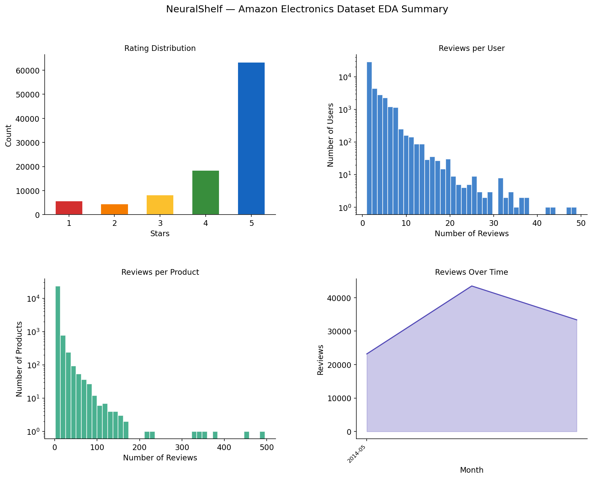
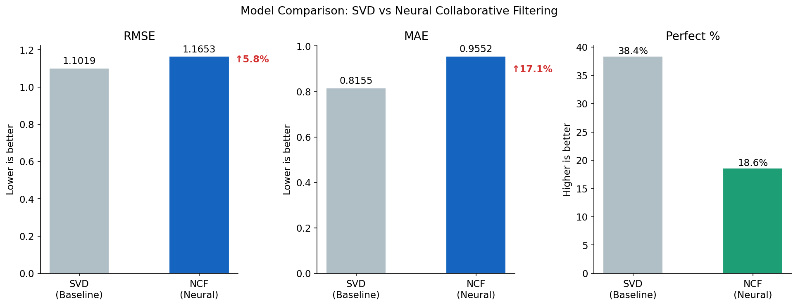
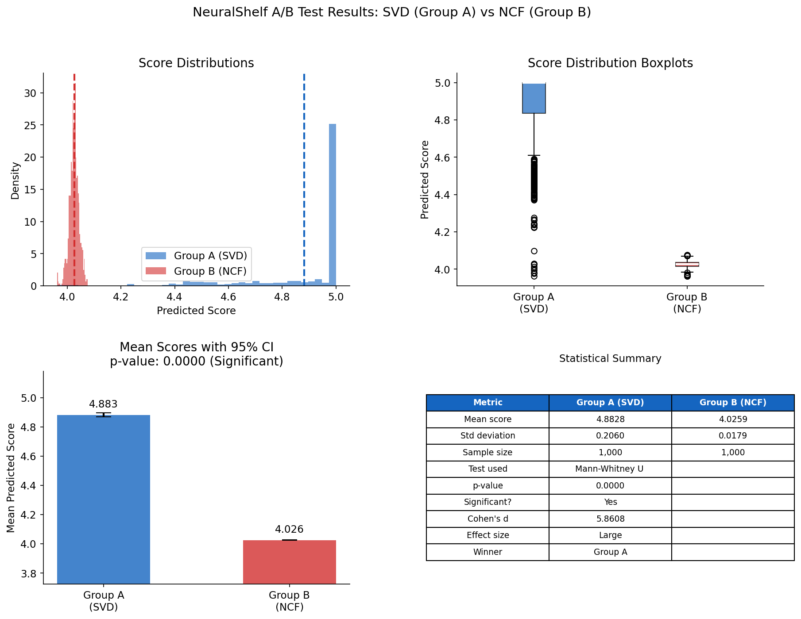

# NeuralShelf — Production-Grade Recommendation Engine

An end-to-end ML recommendation system trained on 100,000 
real Amazon Electronics reviews.

## Models
- SVD Matrix Factorisation (RMSE: 1.10) ← production model
- Neural Collaborative Filtering (RMSE: 1.16)
- A/B Testing validated SVD as winner (p≈0, Cohen's d=5.34)

## Tech Stack
Python, FastAPI, TensorFlow, scikit-surprise, MySQL, 
SQLAlchemy, MLflow, Docker, pandas, numpy

## Architecture
Amazon Data → MySQL → SVD Model → FastAPI REST API
                    → NCF Model  ↗
                    → A/B Test   ↗
                    → MLflow     ↗
                    → Docker     ↗

## Key Results
- 100,000 real Amazon reviews across 41,330 users
- 24,630 unique products
- SVD achieved RMSE 1.10 on test set
- A/B test confirmed SVD superiority with p≈0
- Full Docker deployment with docker-compose
- MLflow experiment tracking across all runs

## Charts

### EDA Summary

### Model Comparison

### A/B Test Results

## How to Run
1. Clone the repo
2. Add .env file with MySQL credentials
3. Run: docker compose up
4. Visit: http://localhost:8002/docs

## Project Structure
neuralshelf_notebook.ipynb  — full ML pipeline
neuralshelf_api/            — FastAPI server
  main.py                   — API endpoints
  models.py                 — ML model serving
  database.py               — MySQL connection
  schemas.py                — API data shapes
  Dockerfile                — container definition
  docker-compose.yml        — multi-container setup
